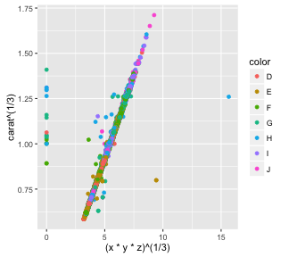

## Linear Model for Diamond Price Prediction 

### Purpose

- Demonstrate R data product using **shiny** apps and **slidify**
- Prediction of diamond price using a linear model
- Interactive selection of sample size and predictor variables 

### Data set


```r
library(ggplot2); data(diamonds)
```

- Data set consists of 10 variables and 53940 observations.


```
##  [1] "carat"   "cut"     "color"   "clarity" "depth"   "table"   "price"  
##  [8] "x"       "y"       "z"
```

--- .class #id 

## Motivation for Modelling Choices

- Weight (carat) and size (x, y, z) are good predictors of price but are *correlated*
  + Carat is a function of size => Exclude variable x, y, z
  + Use **cubic root of carat** as a proxy for size
- Price data concentrated at low values and decays as price increases => **log** transformation



- Reference: [Lecture notes][LN] from Udacity course [UD651 "Data Analysis with R"][UD]

[LN]: https://s3.amazonaws.com/udacity-hosted-downloads/ud651/EDAL6Notes.pdf "UD651 Lecture Notes"
[UD]: https://www.udacity.com/course/data-analysis-with-r--ud651 "UD651 Data Analysis with R"


---

## Shiny App

https://vgarzon.shinyapps.io/diamondPriceLM/

<div style='text-align: center;'>
    
</div>

---

## Trying the App

- The initial model is price ~ carat.  Add features to model from left panel
- Plot compares test data observations against prediction.  Red line shows perfect prediction
- Try price and carat transformation.  Watch prediction error change
- Try different sample sizes and training set fractions

<div style='text-align: center;'>
    
</div>

